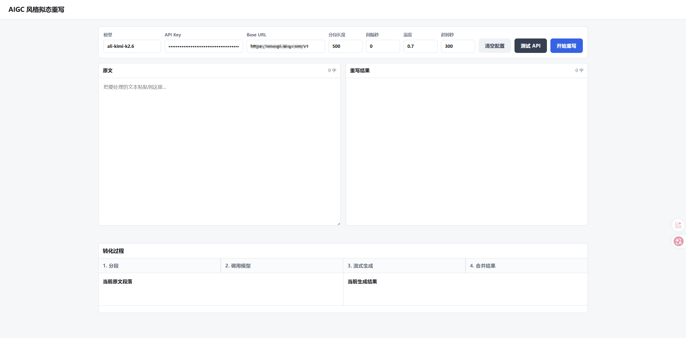
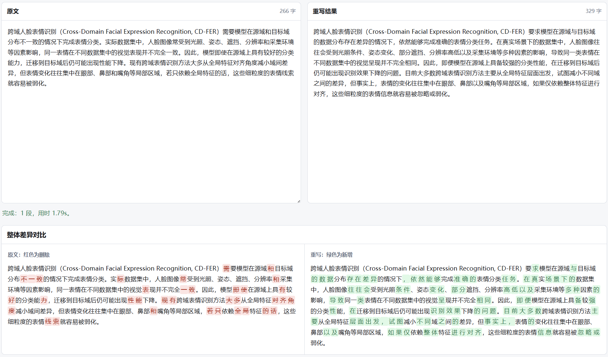
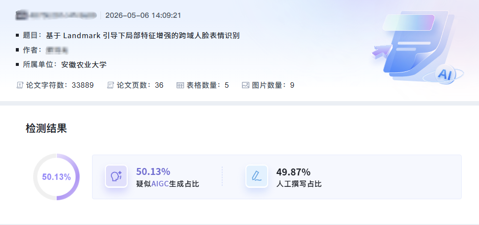
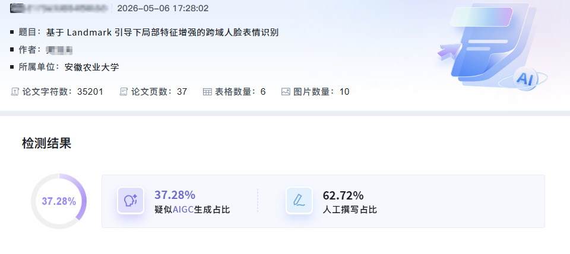
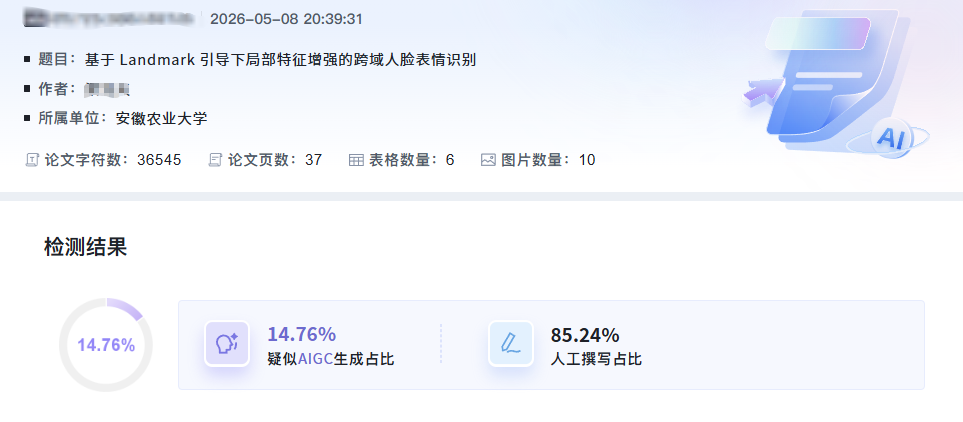

# FuckAIGC

一个纯本地、轻量的 AIGC 风格拟态重写工具。

它从原项目中抽离出“风格拟态专家”重写逻辑，去掉了完整前后端、数据库、卡密系统、后台管理和 React 构建，只保留一个可以直接运行的本地网页。

## 特点

- 本地浏览器直接使用，无需额外前端框架
- 仅依赖 Python 标准库启动 HTTP 服务
- 兼容 OpenAI 风格的 `/chat/completions` 接口
- 支持 API 连通性测试
- 支持按段落切分重写
- 支持流式显示生成过程
- 支持整体前后对比与分段对比
- 新增内容标绿，删除内容标红
- 支持清空浏览器保存的 API 配置

## 界面预览

### 主页


### 文本增强过程


## 效果展示

### 第一次提交


### 第二次提交


### 第三次提交


## 项目结构

```text
FuckAIGC/
├── app.py       # 本地网页和 API 服务入口
├── prompt.py    # 风格拟态专家提示词
├── .env.example # 环境变量示例
├── .gitignore   # Git 忽略规则
└── README.md    # 项目说明
```

## 环境要求

- Python 3.10+
- 无需安装额外依赖

## 快速开始

1. 进入项目目录：

```bash
cd /home/myuser/projects/FuckAIGC
```

2. 启动服务：

```bash
python app.py
```

3. 打开页面：

```text
http://127.0.0.1:7860
```

如果 `7860` 端口被占用，可以换一个端口：

```bash
REWRITER_PORT=7870 python app.py
```

然后访问：

```text
http://127.0.0.1:7870
```

## API 配置

你可以直接在页面顶部填写这些参数：

- 模型
- API Key
- Base URL
- 分段长度
- 间隔秒
- 温度
- 超时秒

示例：OpenAI 官方接口

```text
模型: gpt-5
Base URL: https://api.openai.com/v1
API Key: 你的 API Key
```

示例：Gemini 的 OpenAI 兼容接口

```text
模型: gemini-2.5-pro
Base URL: https://generativelanguage.googleapis.com/v1beta/openai
API Key: 你的 API Key
```

页面中填写的配置会保存在浏览器 `localStorage` 里。点击 **清空配置** 可以删除这些本地缓存。

## 使用 .env

复制示例文件：

```bash
cp .env.example .env
```

然后编辑 `.env`：

```env
ENHANCE_MODEL=gemini-2.5-pro
ENHANCE_API_KEY=你的API_KEY
ENHANCE_BASE_URL=https://generativelanguage.googleapis.com/v1beta/openai
```

也可以直接使用通用 OpenAI 兼容配置：

```env
OPENAI_API_KEY=你的API_KEY
OPENAI_BASE_URL=https://api.openai.com/v1
```

注意：`.env` 不建议提交到 Git。

## 使用流程

1. 在页面中填写文本和 API 配置。
2. 点击 **测试 API**，确认模型、Key 和 Base URL 可用。
3. 点击 **开始重写**，程序会按段落拆分文本并调用模型生成。
4. 生成过程中可以查看当前段落、输出内容和日志。
5. 完成后查看整体前后对比与分段差异。

## 按钮说明

### 测试 API

发送一个最小请求，用来确认：

- API Key 是否有效
- Base URL 是否正确
- 模型名是否可用
- 接口是否兼容 OpenAI `/chat/completions`

### 开始重写

执行完整转化流程：

1. 按段落切分输入文本
2. 使用 `prompt.py` 中的提示词
3. 调用模型流式生成
4. 逐段展示生成过程
5. 合并最终结果
6. 显示前后差异

### 清空配置

清除浏览器 `localStorage` 中保存的配置，包括模型、API Key、Base URL 等。

## 可视化内容

页面会展示四个阶段：

```text
1. 分段
2. 调用模型
3. 流式生成
4. 合并结果
```

同时会显示：

- 当前原文段落
- 当前生成结果
- 过程日志

## 差异对比

工具会对原文和重写结果做可视化 diff：

- 红色表示删除内容
- 绿色表示新增内容

对比包括：

- 整体差异对比
- 分段前后对比

中文按字符对比，英文按词、空白和标点对比。

## 常见问题

### 端口已被占用

说明端口被占用，换端口启动即可：

```bash
REWRITER_PORT=7870 python app.py
```

### API HTTP 403

通常是 Base URL 填错，或者接口网关拒绝访问。

Base URL 应该填到 OpenAI 兼容 API 根路径，例如：

```text
https://api.openai.com/v1
```

不要填网页后台地址，也不要填完整的 `/chat/completions`，脚本会自动拼接：

```text
{Base URL}/chat/completions
```

### 请求超时

说明模型太久没有返回内容，可以尝试：

- 增大 **超时秒**
- 降低 **分段长度**
- 更换响应更快的模型
- 检查代理或中转服务是否稳定

### 删除 .env 后仍然自动填入

这是浏览器 `localStorage` 缓存。点击页面顶部的 **清空配置** 即可。

## 说明

这个工具只做文本风格重写，不接入任何 AIGC 检测器，也不保证通过任何检测系统。

如果用于学术场景，请遵守学校、期刊或机构关于 AI 辅助写作的规定。核心观点、研究方法、数据分析和结论仍应由作者自己负责。
